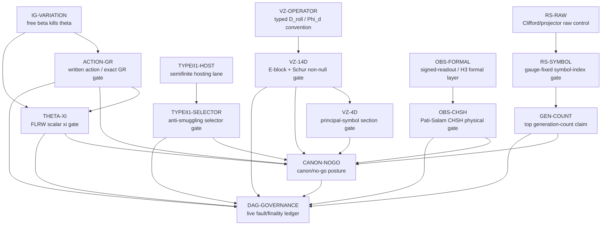

# Live Claim DAG / Fault Model / Finality Ledger

## Verdict

This ledger is a governance layer over live claims. It does not prove any theorem and it
does not promote any exploration to canon. Its job is to prevent three common failures:

1. treating controls, raw ranks, toy selectors, or ansatz states as derived results;
2. letting stale prose survive after a correction or supersession;
3. hiding load-bearing blockers inside linear narrative.

The top-level live posture is:

```text
generation count:              OPEN
RS symbol-index gate:           SPECIFIED_OPEN
VZ 14D:                         CONDITIONALLY_EVADED
VZ 4D:                          CONDITIONALLY_RESOLVED, principal-symbol only
Type II_1 selector:             NEGATIVE_FILTER / NO_SELECTOR_YET
GU action and exact GR:         OPEN_ACTION_GATE
theta / FLRW xi:                OPEN_ACTION_GATE for GU provenance
observer-finality CHSH:         EXECUTABLE_CONTROLS_GU_PENDING
no-go map / canon posture:      CANON_DISCIPLINE, not physics proof
```

## Status And Grade Enums

Use these status labels in this ledger:

```text
canon_discipline
open
specified_open
advanced_but_open
conditional
negative_filter
blocked
executable_controls_pending
governance_active
```

Use these proof-grade labels:

```text
canon_posture
formal_theorem
executable_control
reconstruction
conditional_reconstruction
contract_only
specification
open_none
governance
```

Finality meanings:

```text
not_final              may not be cited as settled
conditional_finality   cite only with named dependencies and failure conditions
canon_surface          safe as current public posture, not proved physics
governance_finality    useful for status transitions, not evidence
```

## Machine-Readable Node Registry

This JSON block is intentionally small. The human node cards below carry the full fault
model. The audit script, if run, checks that node IDs, dependency IDs, status values, and
proof grades stay coherent.

```json
{
  "version": "2026-06-24",
  "status_enum": [
    "canon_discipline",
    "open",
    "specified_open",
    "advanced_but_open",
    "conditional",
    "negative_filter",
    "blocked",
    "executable_controls_pending",
    "governance_active"
  ],
  "proof_grade_enum": [
    "canon_posture",
    "formal_theorem",
    "executable_control",
    "reconstruction",
    "conditional_reconstruction",
    "contract_only",
    "specification",
    "open_none",
    "governance"
  ],
  "nodes": [
    {
      "id": "CANON-NOGO",
      "status": "canon_discipline",
      "proof_grade": "canon_posture",
      "deps": ["RS-SYMBOL", "VZ-14D", "VZ-4D", "TYPEII1-SELECTOR", "ACTION-GR", "THETA-XI", "OBS-CHSH"]
    },
    {
      "id": "RS-RAW",
      "status": "advanced_but_open",
      "proof_grade": "executable_control",
      "deps": []
    },
    {
      "id": "RS-SYMBOL",
      "status": "specified_open",
      "proof_grade": "contract_only",
      "deps": ["RS-RAW"]
    },
    {
      "id": "GEN-COUNT",
      "status": "open",
      "proof_grade": "open_none",
      "deps": ["RS-SYMBOL"]
    },
    {
      "id": "VZ-OPERATOR",
      "status": "specified_open",
      "proof_grade": "specification",
      "deps": []
    },
    {
      "id": "VZ-14D",
      "status": "conditional",
      "proof_grade": "conditional_reconstruction",
      "deps": ["VZ-OPERATOR"]
    },
    {
      "id": "VZ-4D",
      "status": "conditional",
      "proof_grade": "conditional_reconstruction",
      "deps": ["VZ-14D"]
    },
    {
      "id": "TYPEII1-HOST",
      "status": "conditional",
      "proof_grade": "reconstruction",
      "deps": []
    },
    {
      "id": "TYPEII1-SELECTOR",
      "status": "negative_filter",
      "proof_grade": "formal_theorem",
      "deps": ["TYPEII1-HOST"]
    },
    {
      "id": "IG-VARIATION",
      "status": "blocked",
      "proof_grade": "reconstruction",
      "deps": []
    },
    {
      "id": "ACTION-GR",
      "status": "open",
      "proof_grade": "specification",
      "deps": ["IG-VARIATION"]
    },
    {
      "id": "THETA-XI",
      "status": "open",
      "proof_grade": "conditional_reconstruction",
      "deps": ["ACTION-GR", "IG-VARIATION"]
    },
    {
      "id": "OBS-FORMAL",
      "status": "conditional",
      "proof_grade": "formal_theorem",
      "deps": []
    },
    {
      "id": "OBS-CHSH",
      "status": "executable_controls_pending",
      "proof_grade": "executable_control",
      "deps": ["OBS-FORMAL"]
    },
    {
      "id": "DAG-GOVERNANCE",
      "status": "governance_active",
      "proof_grade": "governance",
      "deps": ["CANON-NOGO", "GEN-COUNT", "VZ-14D", "TYPEII1-SELECTOR", "ACTION-GR", "THETA-XI", "OBS-CHSH"]
    }
  ]
}
```

## Mermaid DAG



## Adjacency List

```text
RS-RAW -> RS-SYMBOL -> GEN-COUNT -> CANON-NOGO -> DAG-GOVERNANCE
VZ-OPERATOR -> VZ-14D -> VZ-4D -> CANON-NOGO -> DAG-GOVERNANCE
TYPEII1-HOST -> TYPEII1-SELECTOR -> CANON-NOGO -> DAG-GOVERNANCE
IG-VARIATION -> ACTION-GR -> THETA-XI -> CANON-NOGO -> DAG-GOVERNANCE
IG-VARIATION -> THETA-XI
OBS-FORMAL -> OBS-CHSH -> CANON-NOGO -> DAG-GOVERNANCE
```

## Node Cards

### CANON-NOGO

- Owner file: `CANON.md`, `RESEARCH-STATUS.md`, `canon/no-go-class-relative-map.md`.
- Current status: `canon_discipline`.
- Proof grade: `canon_posture`.
- Finality posture: `canon_surface`; safe to cite as current public posture, not proof of GU.
- Dependencies: `RS-SYMBOL`, `VZ-14D`, `VZ-4D`, `TYPEII1-SELECTOR`, `ACTION-GR`, `THETA-XI`, `OBS-CHSH`.
- Forbidden inputs: "GU is proved"; "VZ verified"; "three generations derived"; "observer-finality evades no-goes"; any stale status that contradicts the latest correction.
- Fault/adversary model: stale canon drift, same-session verdict inflation, linear prose hiding a demotion, and smooth-bundle shadow language being mistaken for a theorem.
- Closure condition: canon summaries and no-go rows name every live blocker, carry the latest correction labels, and do not use a stronger status than the child nodes allow.
- Demotion condition: any canon-facing row says a downstream claim is verified, evaded, or derived while its child gate is still open or conditional.
- Supersession notes: VZ-01 and VZ-02 control VZ language; generation count is open despite older `24` narratives; Type II_1 remains host/selector-separated; observer-finality is a test layer.

### RS-RAW

- Owner file: `explorations/generation-sector/generation-count-rs-clifford-projector-computation-2026-06-24.md`.
- Current status: `advanced_but_open`.
- Proof grade: `executable_control`.
- Finality posture: `conditional_finality` for raw Clifford/projector sanity only.
- Dependencies: none inside this ledger.
- Forbidden inputs: using raw ranks `416`, `96`, `48_H`, or `24_H` as APS effective rank; treating a sampled full-rank raw symbol as a K-theory index.
- Fault/adversary model: raw finite-dimensional algebra masquerades as an analytic index; right-H conversion is assumed instead of verified; gauge directions are silently quotiented.
- Closure condition: none for generation count. This node closes only the local projector sanity claim: explicit Cl(4,0), gamma-trace maps, kernel projectors, and raw sampled symbol checks exist.
- Demotion condition: cite this node as deciding Candidate A or Candidate B.
- Supersession notes: this node supersedes vague "mysterious RS projector rank" language by making the raw rank concrete, but it is subordinate to `RS-SYMBOL`.

### RS-SYMBOL

- Owner file: `explorations/generation-sector/generation-count-rs-symbol-index-contract-2026-06-24.md`.
- Current status: `specified_open`.
- Proof grade: `contract_only`.
- Finality posture: `not_final`.
- Dependencies: `RS-RAW`, K3 invariants, explicit Cl(4,0) data, right-H structure, gamma-trace projectors, gauge-fixing or elliptic complex, Chern-character data, APS boundary data if a boundary is used.
- Forbidden inputs: `ind_H(D_RS)=8`, `rank_H(E_RS^eff)=4`, total `ind_H(D_GU)=24`, three generations, physical DOF count as analytic theorem, normalization chosen after observing the target value.
- Fault/adversary model: circular target insertion, missing ghost/gauge data, non-elliptic raw RS operator, hidden `ch_2(F)` dependence, complex-only index reported as H-linear, APS eta assumed for the wrong boundary operator.
- Closure condition: an independent artifact constructs the constrained/gauge-fixed RS symbol class or elliptic complex, proves ellipticity, evaluates the Atiyah-Singer/APS index, and emits one decision: `CANDIDATE_A`, `CANDIDATE_B`, `OTHER_INDEX`, `NON_ELLIPTIC`, `OPEN_BACKGROUND_DEPENDENT`, `COMPLEX_ONLY_H_STRUCTURE_MISSING`, `OPEN_MISSING_SYMBOL_DATA`, or `INVALID_CIRCULAR`.
- Demotion condition: the attempted index uses any forbidden target as input, omits gauge/ghost terms while claiming a physical RS index, or leaves the index dependent on an unspecified background class.
- Supersession notes: older OQ-RK1/OQ-RK2 rank formulas that hit `4` or `8` by reverse engineering are not live proof; the live invariant is the symbol class.

### GEN-COUNT

- Owner file: `explorations/generation-sector/generation-count-rs-rank-gate-2026-06-24.md`, with top-level posture in `RESEARCH-STATUS.md` and `CANON.md`.
- Current status: `open`.
- Proof grade: `open_none`.
- Finality posture: `not_final`.
- Dependencies: `RS-SYMBOL`; the spin-1/2 K3 contribution; index additivity; the generation normalization that turns `16 + ind_H(D_RS)` into generation count.
- Forbidden inputs: three generations, total index `24`, `ind_H(D_RS)=8`, or `rank_eff=4` before the RS symbol-index computation is complete.
- Fault/adversary model: Candidate A is selected because it gives three generations; Candidate B is ignored without a derivation; compact K3 toy logic is silently treated as the noncompact `Y14` theorem.
- Closure condition: `RS-SYMBOL` returns an independently computed H-linear index, then the additivity and normalization gates are applied without changing convention. `I=8` supports Candidate A; `I=16` supports Candidate B; any other value updates or breaks the generation count.
- Demotion condition: `RS-SYMBOL` returns non-elliptic, background-dependent, complex-only, circular, or another index incompatible with integral SM-generation normalization.
- Supersession notes: scalar BC1, A3 scalar discrete-series, and tau-twisted routes do not currently derive the RS leg; raw projector rank progress does not change this node's status.

### VZ-OPERATOR

- Owner file: `explorations/vz-evasion/vz-principal-symbol-convention-reconciliation-2026-06-24.md`.
- Current status: `specified_open`.
- Proof grade: `specification`.
- Finality posture: `not_final`.
- Dependencies: canonical typed definitions for `Phi_2`, `Phi_d := Phi_2 o d_A`, `Phi_F := Phi_2(F_A tensor -)`, `D_roll`, chirality domains, and Q-sector coordinates.
- Forbidden inputs: using zero-order `Phi_F` as though it supplied the first-order `F_xi`; mixing trace-coordinate and embedded-coordinate E-block matrices; suppressing chirality/domain changes in a proof-grade upgrade.
- Fault/adversary model: two different operators are called "shiab" and their symbols are conflated; the E-block belongs to a convention-level model rather than the actual GU operator.
- Closure condition: one authoritative definition of the rolled-up 0/1 sector states whether the one-form block contains `Phi_2(d_A psi)`, fixes domains/codomains, and names lower-order terms separately.
- Demotion condition: the actual GU operator has only zero-order curvature insertion in the relevant block; then the current VZ E-block must be recomputed and `VZ-14D` cannot use the existing coefficient proof.
- Supersession notes: the notation fix is binding for future graph maintenance: reserve `Phi_2` for the zero-order algebraic map, `Phi_d` for the first-order composite, and `Phi_F` for zero-order curvature coupling.

### VZ-14D

- Owner file: `explorations/vz-evasion/vz-proof-grade-verification-gate-2026-06-24.md`, `explorations/vz-evasion/vz-e-block-independent-rederivation-2026-06-24.md`, and `explorations/vz-evasion/no-go-velo-zwanziger-canon-entry-2026-06-23.md`.
- Current status: `conditional`.
- Proof grade: `conditional_reconstruction`.
- Finality posture: `conditional_finality`; cite only as 14D `CONDITIONALLY_EVADED`.
- Dependencies: `VZ-OPERATOR`; Q-sector splitting; coefficient derivation `1/14` and `13/98`; non-null `G^2 = xi2 Id`; independent E-block invertibility; determinant-free Schur kernel replay.
- Forbidden inputs: `det(M)=det(E)*det(S_R)` as proof of E-invertibility; same-session sibling closure of the VZ-01 circularity flag; untyped Q-sector or mixed coordinate inverse.
- Fault/adversary model: same-session circularity, E-block coefficient drift, Q-sector incompleteness, null/non-null confusion, and treating local arithmetic sanity as proof-grade verification.
- Closure condition: later-session or external proof derives the actual Q-sector E-block from the canonical operator, proves a two-sided inverse or kernel proof for every non-null 14D covector, and then replays the Schur argument without determinant circularity.
- Demotion condition: there exists a non-null 14D covector with `ker E(xi) != 0`, or the canonical operator definition invalidates the `F_xi` principal block.
- Supersession notes: current arithmetic is strong conditional progress; it supersedes the old determinant-circular proof but not the conditional status.

### VZ-4D

- Owner file: `canon/no-go-class-relative-map.md`, `explorations/vz-evasion/no-go-velo-zwanziger-canon-entry-2026-06-23.md`, and `explorations/vz-evasion/vz-proof-grade-verification-gate-2026-06-24.md`.
- Current status: `conditional`.
- Proof grade: `conditional_reconstruction`.
- Finality posture: `conditional_finality`; cite as 4D principal-symbol `CONDITIONALLY_RESOLVED`, not verified.
- Dependencies: `VZ-14D` for origin story, plus the section-pullback principal-symbol computation, 4D E-block invertibility, and subprincipal/extrinsic-curvature checks.
- Forbidden inputs: the word `VERIFIED` while FC-VZ-4 remains live; using the 4D principal-symbol result as full dynamical VZ evasion; using "trivial internal coupling" after Pati-Salam charge content fired H3.
- Fault/adversary model: subprincipal `II_s` terms produce spacelike characteristics; a standalone GU RS Lagrangian exists; `F_A` enters B/C at first order; loop corrections decouple B/C; constrained-Hamiltonian propagation is only sketched.
- Closure condition: show no subprincipal/extrinsic-curvature spacelike characteristics, prove no inequivalent standalone RS Lagrangian or handle it, and close subsidiary-condition propagation and IR B/C stability.
- Demotion condition: FC-VZ-4 fires, or any full dynamical analysis produces spacelike characteristics in the physical 4D effective RS cone.
- Supersession notes: VZ-02 downgraded the 4D language from verified to conditionally resolved. This ledger preserves that correction.

### TYPEII1-HOST

- Owner file: `explorations/type-ii1-spectral/type-ii1-construction-or-nogo-gate-2026-06-24.md`, `canon/type-ii1-spectral-sm-checklist.md`, and `specifications/type-ii1-spectral-sm/type-ii1-extension-requirements.md`.
- Current status: `conditional`.
- Proof grade: `reconstruction`.
- Finality posture: `conditional_finality` as a hosting/construction lane.
- Dependencies: finite CC sector embedding, semifinite spectral triple, KO-6 sign package, twisted real structure, J-and-D bridge, epsilon-prime sign check.
- Forbidden inputs: claiming the host selects the SM algebra, gauge group, representations, or generations; treating MIP*=RE or non-embeddability as load-bearing when the working construction is hyperfinite.
- Fault/adversary model: embedding is mistaken for explanation; full `U(R)` fluctuations are too large; extra Type II_1 modes survive with anomaly; non-embeddable content is decorative.
- Closure condition: a coherent semifinite host preserves finite Connes controls with no hidden sign, bridge, anomaly, or spectral-action failure.
- Demotion condition: bridge failure, anomaly from extra modes, gauge failure, or spectral-action/semifinite triple obstruction.
- Supersession notes: the easy no-go did not fire. This supports "host open", not "selector found".

### TYPEII1-SELECTOR

- Owner file: `explorations/type-ii1-spectral/type-ii1-selector-candidate-2026-06-24.md` and `explorations/type-ii1-spectral/type-ii1-selector-anti-smuggling-theorem-2026-06-24.md`.
- Current status: `negative_filter`.
- Proof grade: `formal_theorem` for the cardinality-only anti-smuggling filter; reconstruction for candidate audits.
- Finality posture: `conditional_finality` for the negative filter; no positive selector finality.
- Dependencies: `TYPEII1-HOST`; a proposed `(N subset M, tau, p_i, Phi_CC)` object; replacement `C_n` test.
- Forbidden inputs: externally supplied `A_F`, one-generation `K_SM`, three CC copies, order-3 group choice, index-3 inclusion, D4 triple arm, or equal trace splitting as an explanation of `3`.
- Fault/adversary model: count transported through Type II_1 language, trace equivalence is too cheap, `Phi_CC` imports the SM, and hyperfinite `C_n` toys replicate the same proof for arbitrary `n`.
- Closure condition: fixed Type II_1 data force exactly three CC generation sectors, defeat nearby `n != 3` replacements, and functorially recover the finite-control shadow while preserving `J`, `gamma`, `D`, order-one, and anomaly constraints.
- Demotion condition: every candidate remains cardinality-only, or `Phi_CC` maps `K_SM tensor C^n` for arbitrary `n`.
- Supersession notes: C3/D4 is the canonical toy failure. Do not search for "another visible 3" until a candidate can beat the anti-smuggling theorem.

### IG-VARIATION

- Owner file: `explorations/misc/ig-dynamics-nonzero-theta-action-gate-2026-06-24.md`.
- Current status: `blocked`.
- Proof grade: `reconstruction`.
- Finality posture: `conditional_finality` for the negative branch: free beta plus only `|theta|^2` kills theta.
- Dependencies: a written GU action or tau-plus/IG geometry fixing the allowed variation space of `(eps,beta)`.
- Forbidden inputs: varying `beta` freely and still claiming nonzero theta from the bare norm; inventing a constraint only to save the model; preserving `D_A^*F_A=theta` after adding dynamical IG current without recalculation.
- Fault/adversary model: auxiliary-field collapse, spurion gauge breaking, A-dependent constraints modifying the connection equation, and total-current conservation being confused with theta conservation.
- Closure condition: derive one of the allowed branches from primary GU structure: non-varied background/Stueckelberg data, A-independent constrained IG variables, or dynamical IG fields with a revised total-current equation.
- Demotion condition: the actual action has free `(eps,beta)` and only the bare theta norm; then `theta=0` and the theta dark-energy/action source story fails in that branch.
- Supersession notes: Branch 2A is the recommended conservative salvage; branch 3 is physically healthier for dark energy but revises canon source language.

### ACTION-GR

- Owner file: `explorations/cycle-gates-and-audits/gu-action-4d-physics-gate-2026-06-24.md` and `explorations/cycle-gates-and-audits/gu-minimal-action-spec-2026-06-24.md`.
- Current status: `open`.
- Proof grade: `specification`.
- Finality posture: `not_final`.
- Dependencies: `IG-VARIATION`; written `S_GU`; full Euler-Lagrange tuple `(E_s,E_A,E_eps,E_beta,E_Psi)`; horizontal-normalized `II_s^H`; sign and normalization conventions.
- Forbidden inputs: using weak-field `O(M/r)` Schwarzschild as exact GR recovery; relabeling `Q^TF(B_s)` as vacuum matter; adding bare `Lambda` or missing cross-terms without source; leaving `S_IG-dyn` unspecified.
- Fault/adversary model: action unwritten, Willmore-only exact Schwarzschild obstruction, Kerr failure, normalization drift, wrong `II_s` convention, hidden matter source, IG equations kill the solution.
- Closure condition: exact Schwarzschild and Kerr admit smooth vacuum configurations satisfying the full written EL tuple with correct boundary data and no matter relabeling.
- Demotion condition: either exact black-hole metric fails the full EL tuple, or the action requires unspecified IG dynamics/cross-terms to cancel the residual.
- Supersession notes: the weak-field canon remains bounded and useful, but it does not promote this node.

### THETA-XI

- Owner file: `explorations/cycle-gates-and-audits/gu-action-4d-physics-gate-2026-06-24.md`, `explorations/cycle-gates-and-audits/gu-minimal-action-spec-2026-06-24.md`, `canon/theta-field-flrw-dark-energy-eos.md`, and `explorations/dark-energy-cosmology/dark-energy-w-window-mechanism-2026-06-23.md`.
- Current status: `open`.
- Proof grade: `conditional_reconstruction`.
- Finality posture: `not_final` for GU provenance; `conditional_finality` for the cosmology mechanism search.
- Dependencies: `ACTION-GR`, `IG-VARIATION`; scalar character of `s^*theta`; canonical normalization `B = sqrt(Z_theta) b_raw`; `M_KK`; generated curvature coupling `xi_eff`.
- Forbidden inputs: inserting `xi ~= -0.6` by hand; treating minimal `xi=0` or conformal `xi=+1/6` as DESI-sign pass; applying the scalar KG result if `s^*theta` is not scalar; ignoring field normalization in `xi_eff`.
- Fault/adversary model: working FLRW mechanism is phenomenological but not GU-derived; `M_KK` changes under root-system correction; slow-roll/phase assumptions drift; negative xi appears only as a free parameter; IG dynamics needed for the mode is unspecified.
- Closure condition: the written GU action reduces to a canonical homogeneous scalar theta mode with `M_KK` compatible with the theta-field input and `xi_eff < -0.319`, preferably near `-0.6`, without hand insertion.
- Demotion condition: no `R theta^2` term appears, `xi_eff >= -0.319`, the mode is not scalar, `M_KK` exits the oscillating regime, or the needed negative coupling depends on unspecified `S_IG-dyn`.
- Supersession notes: the old negative `w_a` de Sitter estimate is retracted; the only currently identified DESI-sign mechanism is non-minimal negative curvature coupling, whose GU provenance is open.

### OBS-FORMAL

- Owner file: `explorations/time-as-finality-crosswalk/observer-finality-physical-forcing-gate-2026-06-24.md`, `explorations/time-as-finality-crosswalk/observer-finality-layer.md`, and `explorations/time-as-finality-crosswalk/h3-chsh-four-patch-fixture-2026-06-23.md`.
- Current status: `conditional`.
- Proof grade: `formal_theorem`.
- Finality posture: `conditional_finality` as formal/protocol layer only.
- Dependencies: signed-readout hypotheses, NAC, odd-SBP, record graph definitions, and local/domain-relative finality discipline.
- Forbidden inputs: universal global commit order; using observer-finality as a no-go theorem escape hatch; treating odd-SBP as physically forced before GU supplies state and measurement data.
- Fault/adversary model: finality protocol becomes metaphor, formal holonomy is confused with physical CHSH violation, or BvN/C_MPR slogans substitute for defined categories and functors.
- Closure condition: formal layer remains useful if it catches status errors and produces executable falsification surfaces while preserving local causal accessibility.
- Demotion condition: the layer adds ceremony but no decisions, or fails to distinguish evidence order, causal order, finality relation, and readout order.
- Supersession notes: C_SR is a useful reduct; the BvN wall is not yet a theorem.

### OBS-CHSH

- Owner file: `explorations/time-as-finality-crosswalk/observer-finality-pati-salam-chsh-fixture-2026-06-24.md`, `explorations/time-as-finality-crosswalk/observer-finality-gu-derived-chsh-state-attempt-2026-06-24.md`, and `explorations/time-as-finality-crosswalk/observer-finality-physical-forcing-gate-2026-06-24.md`.
- Current status: `executable_controls_pending`.
- Proof grade: `executable_control`.
- Finality posture: `not_final` for physical forcing; controls only.
- Dependencies: `OBS-FORMAL`; GU-derived `rho_AB`; GU-admissible observables; Pati-Salam left/right split; NAC/local commutativity.
- Forbidden inputs: copying the Bell control into the GU slot, relabeling a Pati-Salam ansatz as a GU state, choosing noncommuting Pauli observables without a GU measurement postulate, or using generic vacuum entanglement as a finite density matrix.
- Fault/adversary model: control state mistaken for evidence, ansatz state overpromoted, product state gives `CHSH <= 2`, observables are not physical SM/GU measurements, or NAC/locality fails.
- Closure condition: derive a positive trace-one `rho_AB` from zero modes/two-point functions plus a finite reduction map, derive admissible self-adjoint `+/-1` observables, and compute `Tr(rho_AB S_CHSH) > 2 + epsilon`.
- Demotion condition: derived state is separable, all admissible settings give `CHSH <= 2`, or the only violation comes from hand-inserted Bell correlations.
- Supersession notes: `rho_mix` and `rho_8` are strong ansatz states only. They are controls for future GU input, not physical-forcing proof.

### DAG-GOVERNANCE

- Owner file: this ledger.
- Current status: `governance_active`.
- Proof grade: `governance`.
- Finality posture: `governance_finality`.
- Dependencies: all top gates named above.
- Forbidden inputs: changing a mathematical status by consensus; using the graph as evidence; allowing a node to inherit a stronger status than its weakest load-bearing dependency.
- Fault/adversary model: bureaucracy, stale edges, status laundering, unresolved dependency cycles, and contributor confusion between "supported", "conditional", and "closed".
- Closure condition: the graph changes at least one live decision by flagging a forbidden input, superseded claim, missing dependency, or unearned status upgrade.
- Demotion condition: if the graph stops affecting decisions, or if maintainers must manually reinterpret every edge because node semantics are too vague.
- Supersession notes: this ledger should be revised, not appended to indefinitely. A new gate result should update node status and supersession notes in one pass.

## Fault Classes

| fault id | fault class | typical nodes | guard |
|---|---|---|---|
| F-CIRC | target/circular input | `RS-SYMBOL`, `GEN-COUNT`, `VZ-14D` | forbid target values until after independent computation |
| F-CTRL | control mistaken for derived result | `OBS-CHSH`, `RS-RAW` | label controls as controls and reject copy-paste promotion |
| F-HOST | host mistaken for selector | `TYPEII1-HOST`, `TYPEII1-SELECTOR` | require selected SM datum beyond embedding |
| F-SAME | same-session closure inflation | `VZ-14D`, `CANON-NOGO` | require inter-session or external proof for raised-and-resolved flags |
| F-ACTION | unwritten action or hidden variation | `IG-VARIATION`, `ACTION-GR`, `THETA-XI` | full EL tuple before physics claim |
| F-STALE | stale canon/prose | `CANON-NOGO`, all children | child-node status is the authority |
| F-SHADOW | forgetful-image overclaim | `CANON-NOGO`, `OBS-FORMAL` | state exact theorem class and what the shadow forgets |

## Finality Ledger

| claim | finality state | decision consequence |
|---|---|---|
| Raw RS projector computation | conditional_finality | can be cited as raw algebra only; cannot close generation count |
| RS symbol-index contract | not_final | next worker must compute symbol class; no generation promotion |
| Generation count | not_final | public posture stays open |
| VZ 14D | conditional_finality | cite as conditionally evaded; do not say evaded |
| VZ 4D | conditional_finality | cite as principal-symbol conditionally resolved; do not say verified |
| Type II_1 host | conditional_finality | viable construction lane; no explanatory selector |
| Type II_1 selector | conditional_finality for negative filter | cardinality-only selectors fail; positive selector absent |
| IG free-beta branch | conditional_finality for negative branch | bare free beta plus theta norm kills nonzero theta |
| Exact GR from GU action | not_final | weak-field pass does not close exact black-hole vacuum gate |
| Theta FLRW xi | not_final for GU provenance | negative xi mechanism exists, but coefficient is not derived |
| Observer-finality formal layer | conditional_finality | formal/protocol use only |
| Pati-Salam CHSH | not_final for physical forcing | controls pass; GU state and observables pending |
| Canon/no-go posture | canon_surface | current public map, bounded by child-node status |

## Hegelian Governance Layer

### Steelman

A live claim DAG can keep the project honest because the repo is now a partial order of
gates, controls, corrections, and supersessions. The graph makes the load-bearing edges
visible: RS raw rank is not RS index, C3/D4 is not a selector, the Bell state is not GU
evidence, and VZ E-block arithmetic is not inter-session closure.

### Antithesis

Mathematical proof is not consensus finality. A graph cannot prove a symbol-index theorem,
derive an action, compute `xi`, or produce a GU density matrix. If the graph becomes a
second-order ritual, it can launder uncertainty just as easily as prose can.

### Synthesis

Use the DAG as a fault/finality layer, not as evidence. It governs status transitions and
forbidden inputs. A node may upgrade only when its closure condition is met by a proof,
computation, or executable artifact of the right type. A node may demote immediately when a
fault condition fires, even if the surrounding narrative remains elegant.

### Closure Conditions For This Layer

The governance layer is working if it does at least one of the following in a future pass:

1. blocks a status upgrade by naming the exact unresolved dependency;
2. forces a stale canon or roadmap phrase to be corrected;
3. distinguishes a control/ansatz/host from a derived proof;
4. identifies the next binary computation for a stuck claim;
5. records a demotion without requiring a new synthesis essay.

It should be parked if it cannot reproduce the known live state or if contributors have to
argue about the graph before they can do the mathematics.

## Most Decision-Useful Next Maintenance Rule

**Update the graph at the same moment any node changes status: every upgrade or demotion must name the single dependency, forbidden input, or closure condition that changed, and no downstream node may inherit a stronger status until that edge is updated.**
