<!-- GENERATED from lab/process/path-dependencies.yaml by
     process_gates/path_dependency_audit.py --write.
     Edit the YAML, never this file. -->

# Path dependencies

Why a strange-looking check exists. Each chain ends in a **check**;
each **trap** is a mistake that actually happened, with its date.

```mermaid
graph TD
  PD_SIGNATURE_PARITY["PD-SIGNATURE-PARITY"]
  PD_SIGNATURE_PARITY_s0["EXACT: The DeWitt fibre form is (6,4), and this is INDEPENDENT of the base sign: G..."]
  PD_SIGNATURE_PARITY --> PD_SIGNATURE_PARITY_s0
  PD_SIGNATURE_PARITY_s1["EXACT: So the base sign alone moves the ambient: (3,1)->(9,5), (1,3)->(7,7)."]
  PD_SIGNATURE_PARITY_s0 --> PD_SIGNATURE_PARITY_s1
  PD_SIGNATURE_PARITY_s2["AUTHOR-STATED: Weinstein's equation (12.19) authorially displays g*(TY^(7,7)) = TX^(1,3) +..."]
  PD_SIGNATURE_PARITY_s1 --> PD_SIGNATURE_PARITY_s2
  PD_SIGNATURE_PARITY_s3["EXACT: Cl(9,5) = M(64,H) quaternionic; Cl(7,7) = M(128,R) real. Not real-isomorphic."]
  PD_SIGNATURE_PARITY_s2 --> PD_SIGNATURE_PARITY_s3
  PD_SIGNATURE_PARITY_s4["EXACT: Majorana-Weyl exists iff p-q = 0 mod 8. Of the reachable horns only (7,7) q..."]
  PD_SIGNATURE_PARITY_s3 --> PD_SIGNATURE_PARITY_s4
  PD_SIGNATURE_PARITY_s5["THEOREM: Quaternionic structure forces Kramers doubling, hence EVEN multiplicity."]
  PD_SIGNATURE_PARITY_s4 --> PD_SIGNATURE_PARITY_s5
  PD_SIGNATURE_PARITY_s6["CONDITIONAL: Three generations is ODD. So (9,5) structurally forbids the target; (7,7) p..."]
  PD_SIGNATURE_PARITY_s5 --> PD_SIGNATURE_PARITY_s6
  PD_SIGNATURE_PARITY_chk{"CHECK: State which horn the work stands on"}
  PD_SIGNATURE_PARITY_s6 --> PD_SIGNATURE_PARITY_chk
  PD_SIGNATURE_PARITY_t0("TRAP 2026-08-04")
  PD_SIGNATURE_PARITY_chk -.-> PD_SIGNATURE_PARITY_t0
  PD_SIGNATURE_PARITY_t1("TRAP 2026-08-08")
  PD_SIGNATURE_PARITY_chk -.-> PD_SIGNATURE_PARITY_t1
  PD_SIGNATURE_PARITY_t2("TRAP 2026-08-08")
  PD_SIGNATURE_PARITY_chk -.-> PD_SIGNATURE_PARITY_t2
  PD_SIGNATURE_PARITY_t3("TRAP 2026-08-08")
  PD_SIGNATURE_PARITY_chk -.-> PD_SIGNATURE_PARITY_t3
  PD_GHOST_PARITY["PD-GHOST-PARITY"]
  PD_GHOST_PARITY_s0["THEOREM: Bender-Mannheim's C and Turok-Bateman's ghost parity are the SAME operator ..."]
  PD_GHOST_PARITY --> PD_GHOST_PARITY_s0
  PD_GHOST_PARITY_s1["THEOREM: They come APART at spectral degeneracies, where C exists but is NOT unique."]
  PD_GHOST_PARITY_s0 --> PD_GHOST_PARITY_s1
  PD_GHOST_PARITY_s2["EXACT: At the degenerate point the KINEMATIC parity is exactly well-defined ([P_to..."]
  PD_GHOST_PARITY_s1 --> PD_GHOST_PARITY_s2
  PD_GHOST_PARITY_s3["EXACT: R3's balance is caused by CHI, not by quaternionic structure: {K,chi} = 0 e..."]
  PD_GHOST_PARITY_s2 --> PD_GHOST_PARITY_s3
  PD_GHOST_PARITY_s4["EXACT: Balance requires ANTIcommutation with K. Kramers alone gives only EVENNESS...."]
  PD_GHOST_PARITY_s3 --> PD_GHOST_PARITY_s4
  PD_GHOST_PARITY_s5["EXACT: chi is the Clifford volume element and exists in every even dimension, so t..."]
  PD_GHOST_PARITY_s4 --> PD_GHOST_PARITY_s5
  PD_GHOST_PARITY_chk{"CHECK: Before citing R3 as a blocker, ask: is the claim SPECTRAL or KINEMATIC? Spe..."}
  PD_GHOST_PARITY_s5 --> PD_GHOST_PARITY_chk
  PD_GHOST_PARITY_t0("TRAP 2026-08-08")
  PD_GHOST_PARITY_chk -.-> PD_GHOST_PARITY_t0
  PD_GHOST_PARITY_t1("TRAP 2026-08-08")
  PD_GHOST_PARITY_chk -.-> PD_GHOST_PARITY_t1
  PD_SOURCE_NOTATION["PD-SOURCE-NOTATION"]
  PD_SOURCE_NOTATION_s0["EXACT: Curt states raw (3,7), traceless (3,6), flipped (4,6). The repository compu..."]
  PD_SOURCE_NOTATION --> PD_SOURCE_NOTATION_s0
  PD_SOURCE_NOTATION_s1["EXACT: The mirror is FORCED, not inferred: all three forms are even in A = g^-1 B,..."]
  PD_SOURCE_NOTATION_s0 --> PD_SOURCE_NOTATION_s1
  PD_SOURCE_NOTATION_s2["EXACT: So Curt writes (negatives, positives). His blocks (4,6)+(1,3) = (5,9) == th..."]
  PD_SOURCE_NOTATION_s1 --> PD_SOURCE_NOTATION_s2
  PD_SOURCE_NOTATION_s3["AUTHOR-STATED: The 2021 draft eq (12.19) prints TY^{7,7} = TX^{1,3} + N^{6,4}: base, fibre..."]
  PD_SOURCE_NOTATION_s2 --> PD_SOURCE_NOTATION_s3
  PD_SOURCE_NOTATION_s4["AUTHOR-STATED: Weinstein independently fixes the base at (1,3) in his own voice and gives ..."]
  PD_SOURCE_NOTATION_s3 --> PD_SOURCE_NOTATION_s4
  PD_SOURCE_NOTATION_chk{"CHECK: Declare plus-first or negatives-first before adding any signature pair"}
  PD_SOURCE_NOTATION_s4 --> PD_SOURCE_NOTATION_chk
  PD_SOURCE_NOTATION_t0("TRAP 2026-08-04")
  PD_SOURCE_NOTATION_chk -.-> PD_SOURCE_NOTATION_t0
  PD_SOURCE_NOTATION_t1("TRAP 2026-08-08")
  PD_SOURCE_NOTATION_chk -.-> PD_SOURCE_NOTATION_t1
  PD_SOURCE_NOTATION_t2("TRAP 2026-08-08")
  PD_SOURCE_NOTATION_chk -.-> PD_SOURCE_NOTATION_t2
  PD_CONDITIONAL_VS_SETTLED["PD-CONDITIONAL-VS-SETTLED"]
  PD_CONDITIONAL_VS_SETTLED_s0["EXACT: The declared-base resolver: filed, then falsified the same afternoon by the..."]
  PD_CONDITIONAL_VS_SETTLED --> PD_CONDITIONAL_VS_SETTLED_s0
  PD_CONDITIONAL_VS_SETTLED_s1["EXACT: The non-equivariance retyping: rejected on hostile review; '-g is a differe..."]
  PD_CONDITIONAL_VS_SETTLED_s0 --> PD_CONDITIONAL_VS_SETTLED_s1
  PD_CONDITIONAL_VS_SETTLED_s2["EXACT: The REAL-CLIFFORD-FORM reopen: withdrawn. The row asks which algebra the so..."]
  PD_CONDITIONAL_VS_SETTLED_s1 --> PD_CONDITIONAL_VS_SETTLED_s2
  PD_CONDITIONAL_VS_SETTLED_s3["EXACT: The underlying fact -- the mixed-notation sum -- survived all three and was..."]
  PD_CONDITIONAL_VS_SETTLED_s2 --> PD_CONDITIONAL_VS_SETTLED_s3
  PD_CONDITIONAL_VS_SETTLED_chk{"CHECK: File the finding with its receipt"}
  PD_CONDITIONAL_VS_SETTLED_s3 --> PD_CONDITIONAL_VS_SETTLED_chk
  PD_CONDITIONAL_VS_SETTLED_t0("TRAP 2026-08-08")
  PD_CONDITIONAL_VS_SETTLED_chk -.-> PD_CONDITIONAL_VS_SETTLED_t0
  PD_CONDITIONAL_VS_SETTLED_t1("TRAP 2026-08-09")
  PD_CONDITIONAL_VS_SETTLED_chk -.-> PD_CONDITIONAL_VS_SETTLED_t1
  PD_CONDITIONAL_VS_SETTLED_t2("TRAP 2026-08-14")
  PD_CONDITIONAL_VS_SETTLED_chk -.-> PD_CONDITIONAL_VS_SETTLED_t2
  PD_ULTRAHYPERBOLIC_DOMAIN["PD-ULTRAHYPERBOLIC-DOMAIN"]
  PD_ULTRAHYPERBOLIC_DOMAIN_s0["EXACT: GU's ambient operator is first-order ULTRAHYPERBOLIC on a non-compact 14-ma..."]
  PD_ULTRAHYPERBOLIC_DOMAIN --> PD_ULTRAHYPERBOLIC_DOMAIN_s0
  PD_ULTRAHYPERBOLIC_DOMAIN_s1["THEOREM: The standard Dirac boundary-value literature (Baer-Ballmann, APS, MIT, glob..."]
  PD_ULTRAHYPERBOLIC_DOMAIN_s0 --> PD_ULTRAHYPERBOLIC_DOMAIN_s1
  PD_ULTRAHYPERBOLIC_DOMAIN_s2["THEOREM: For the ultrahyperbolic equation the Cauchy problem is ILL-POSED IN GENERAL..."]
  PD_ULTRAHYPERBOLIC_DOMAIN_s1 --> PD_ULTRAHYPERBOLIC_DOMAIN_s2
  PD_ULTRAHYPERBOLIC_DOMAIN_s3["THEOREM: A citable remedy exists and is NONLOCAL: well-posed on H^m under an explici..."]
  PD_ULTRAHYPERBOLIC_DOMAIN_s2 --> PD_ULTRAHYPERBOLIC_DOMAIN_s3
  PD_ULTRAHYPERBOLIC_DOMAIN_s4["THEOREM: The remedy does not generalise: higher-codimension initial surfaces stay il..."]
  PD_ULTRAHYPERBOLIC_DOMAIN_s3 --> PD_ULTRAHYPERBOLIC_DOMAIN_s4
  PD_ULTRAHYPERBOLIC_DOMAIN_s5["EXACT: C1's 346,112-dimensional admissible moduli is a SECTION-level result at fil..."]
  PD_ULTRAHYPERBOLIC_DOMAIN_s4 --> PD_ULTRAHYPERBOLIC_DOMAIN_s5
  PD_ULTRAHYPERBOLIC_DOMAIN_chk{"CHECK: State which well-posedness you are assuming and for which operator"}
  PD_ULTRAHYPERBOLIC_DOMAIN_s5 --> PD_ULTRAHYPERBOLIC_DOMAIN_chk
  PD_ULTRAHYPERBOLIC_DOMAIN_t0("TRAP 2026-08-08")
  PD_ULTRAHYPERBOLIC_DOMAIN_chk -.-> PD_ULTRAHYPERBOLIC_DOMAIN_t0
  PD_STRUCTURE_TRANSPORT["PD-STRUCTURE-TRANSPORT"]
  PD_STRUCTURE_TRANSPORT_s0["EXACT: The source-owned carrier is two C^(32,32) halves; the block-preserving U(32..."]
  PD_STRUCTURE_TRANSPORT --> PD_STRUCTURE_TRANSPORT_s0
  PD_STRUCTURE_TRANSPORT_s1["EXACT: The inherited source real form is fixed by the trace-owned Hermitian form H..."]
  PD_STRUCTURE_TRANSPORT_s0 --> PD_STRUCTURE_TRANSPORT_s1
  PD_STRUCTURE_TRANSPORT_s2["EXACT: V0.220's source-normal-jet operator is valid, but its concrete B-skew embed..."]
  PD_STRUCTURE_TRANSPORT_s1 --> PD_STRUCTURE_TRANSPORT_s2
  PD_STRUCTURE_TRANSPORT_s3["EXACT: Restoring the trace-H_q fingerprint changes the exact image to rank 120/160..."]
  PD_STRUCTURE_TRANSPORT_s2 --> PD_STRUCTURE_TRANSPORT_s3
  PD_STRUCTURE_TRANSPORT_chk{"CHECK: Inherit carrier, pairing/form, real structure, grading, signature horn and ..."}
  PD_STRUCTURE_TRANSPORT_s3 --> PD_STRUCTURE_TRANSPORT_chk
  PD_STRUCTURE_TRANSPORT_t0("TRAP 2026-08-12")
  PD_STRUCTURE_TRANSPORT_chk -.-> PD_STRUCTURE_TRANSPORT_t0
  PD_I2B_ACTION_OWNER["PD-I2B-ACTION-OWNER"]
  PD_I2B_ACTION_OWNER_s0["AUTHOR-STATED: The source prints Upsilon_print=S(F_A)+*kappa T and separately gives E_act=..."]
  PD_I2B_ACTION_OWNER --> PD_I2B_ACTION_OWNER_s0
  PD_I2B_ACTION_OWNER_s1["EXACT: The repo-composed E_act square and literal endpoint square have equal Euler..."]
  PD_I2B_ACTION_OWNER_s0 --> PD_I2B_ACTION_OWNER_s1
  PD_I2B_ACTION_OWNER_s2["EXACT: The literal endpoint has 182 live raw responses per observed direction and ..."]
  PD_I2B_ACTION_OWNER_s1 --> PD_I2B_ACTION_OWNER_s2
  PD_I2B_ACTION_OWNER_s3["EXACT: Pairing those same raw responses against every selected connection test wit..."]
  PD_I2B_ACTION_OWNER_s2 --> PD_I2B_ACTION_OWNER_s3
  PD_I2B_ACTION_OWNER_chk{"CHECK: Name the action/residual owner before importing any symbol or Spencer result"}
  PD_I2B_ACTION_OWNER_s3 --> PD_I2B_ACTION_OWNER_chk
  PD_I2B_ACTION_OWNER_t0("TRAP 2026-08-13")
  PD_I2B_ACTION_OWNER_chk -.-> PD_I2B_ACTION_OWNER_t0
  PD_I2B_ACTION_OWNER_t1("TRAP 2026-08-14")
  PD_I2B_ACTION_OWNER_chk -.-> PD_I2B_ACTION_OWNER_t1
  PD_SIGNATURE_PARITY === PD_SOURCE_NOTATION
  PD_SIGNATURE_PARITY === PD_GHOST_PARITY
  PD_GHOST_PARITY === PD_SIGNATURE_PARITY
  PD_GHOST_PARITY === PD_CONDITIONAL_VS_SETTLED
  PD_SOURCE_NOTATION === PD_SIGNATURE_PARITY
  PD_CONDITIONAL_VS_SETTLED === PD_SIGNATURE_PARITY
  PD_CONDITIONAL_VS_SETTLED === PD_GHOST_PARITY
  PD_CONDITIONAL_VS_SETTLED === PD_SOURCE_NOTATION
  PD_ULTRAHYPERBOLIC_DOMAIN === PD_SIGNATURE_PARITY
  PD_ULTRAHYPERBOLIC_DOMAIN === PD_CONDITIONAL_VS_SETTLED
  PD_STRUCTURE_TRANSPORT === PD_CONDITIONAL_VS_SETTLED
  PD_STRUCTURE_TRANSPORT === PD_SIGNATURE_PARITY
  PD_I2B_ACTION_OWNER === PD_STRUCTURE_TRANSPORT
  PD_I2B_ACTION_OWNER === PD_CONDITIONAL_VS_SETTLED
```

## PD-SIGNATURE-PARITY

**The ambient horn is not cosmetic: (9,5) forbids an odd generation count and (7,7) permits it. A computation on the wrong horn cannot reach three.**

- **Trigger:** Any work touching the generation count, chirality, spinor reality, Kramers/quaternionic structure, or that builds on a Cl(9,5) carrier.
- **Naive reading:** "(9,5) vs (7,7) is a sign convention, so results transfer." They do not. The two are not real-isomorphic and the reality type is observable.

| # | evidence | fact | receipt |
|---|---|---|---|
| 1 | `EXACT` | The DeWitt fibre form is (6,4), and this is INDEPENDENT of the base sign: G(-g) = G(g) exactly. | `tests/signature_fork_equivariance_defect.py` |
| 2 | `EXACT` | So the base sign alone moves the ambient: (3,1)->(9,5), (1,3)->(7,7). | `tests/signature_fork_equivariance_defect.py` |
| 3 | `AUTHOR-STATED` | Weinstein's equation (12.19) authorially displays g*(TY^(7,7)) = TX^(1,3) + N_g^(6,4), providing a source resolver to the unordered {7,7} horn but not deriving the relative block sign from the action. | `explorations/portfolio-correction-wave-2026-08-12.md` |
| 4 | `EXACT` | Cl(9,5) = M(64,H) quaternionic; Cl(7,7) = M(128,R) real. Not real-isomorphic. | `tests/majorana_weyl_forces_the_seven_seven_horn.py` |
| 5 | `EXACT` | Majorana-Weyl exists iff p-q = 0 mod 8. Of the reachable horns only (7,7) qualifies. | `tests/majorana_weyl_forces_the_seven_seven_horn.py` |
| 6 | `THEOREM` | Quaternionic structure forces Kramers doubling, hence EVEN multiplicity. | `canon/no-go-quaternionic-parity-generation-sector.md` |
| 7 | `CONDITIONAL` | Three generations is ODD. So (9,5) structurally forbids the target; (7,7) permits it. | `explorations/twentyfive-lens-council-on-the-signature-decision-2026-08-08.md` |

**CHECK.** State which horn the work stands on. If Cl(9,5), say so and say whether the result is horn-robust. Treat equation (12.19) as a named SOURCE resolver, not a mathematical settlement. Do NOT let a (9,5) result silently stand in for the source-aligned reconstruction.

**Traps that actually happened:**

- **2026-08-04** — Wave K settled REAL-CLIFFORD-FORM on a MIXED-NOTATION sum: it took the vertical block in repository notation ((7,3)->(6,4)) and the horizontal in the source's ((1,3)), then added them. Read consistently in either notation the sum is (9,5), never (7,7).
  - *Cost:* Four days as the program's primary reconstruction burden on a retracted derivation.
  - *Receipt:* `lab/process/hostile-reviews/2026-08-08-real-clifford-form-settlement-review.md`
- **2026-08-08** — An agent wrote "Cl(3,1) = M(2,H) and Cl(1,3) = M(4,R)". SWAPPED. Correct: three '+' generators = M(4,R) real; one '+' = M(2,H) quaternionic. A sibling artifact hours earlier had it right.
  - *Cost:* Self-contradiction inside one day; caught by re-derivation, not by review.
  - *Receipt:* `tests/signature_fork_equivariance_defect.py`
- **2026-08-08** — M-H9 was named as the fork's resolver while being built on a COMPLEXIFIED Racah-Speiser module. Cl(p,q) (x) C depends only on p+q, so both horns give M(128,C) -- the module was PROVABLY incapable of discriminating, and returned bit-identical output on both horns.
  - *Cost:* A named resolver that could never have worked; falsified at Tier 1.
  - *Receipt:* `explorations/mh9-tier1-mechanism-falsified-2026-08-08.md`
- **2026-08-08** — The Majorana-Weyl candidate called the (6,4) fibre "pinned" because G(-g)=G(g), but the certificate fixes lambda=1/2 and a trace sign. Base-sign invariance at that input does not derive the coefficient or trace-sign choice; the TT criterion used to prefer the sign is an imported physical input.
  - *Cost:* Nearly promoted a sound conditional implication into a resolver for the highest-fan-out fork by moving the convention one level upstream.
  - *Receipt:* `lab/process/hostile-reviews/2026-08-08-majorana-weyl-conditional-resolver-review.md`

**Invalidates if:** The generation count is shown NOT to be the index whose parity Kramers constrains; or a mechanism supplies the odd '+1' outside the Kramers- constrained sector.

## PD-GHOST-PARITY

**"Ghost parity is blocked" is a SPECTRAL result. Turok-Bateman's parity is KINEMATIC and is not touched by it.**

- **Trigger:** Any work citing R3's sign-blindness, the C-operator, Bender-Mannheim, or concluding that the Turok-Bateman mechanism is unavailable to GU.
- **Naive reading:** "R3 showed the ghost-parity mechanism fails on GU's carrier, so TB is dead here." R3 tested whether the SPECTRAL C is dynamics-derived. TB's parity comes from a two-field O(1,1) EMBEDDING and is defined where the spectral C is not.

| # | evidence | fact | receipt |
|---|---|---|---|
| 1 | `THEOREM` | Bender-Mannheim's C and Turok-Bateman's ghost parity are the SAME operator on the simple-spectrum domain (||C - P_ghost|| -> 3e-8). | `explorations/big-swing-2026-07-06/BIG-SWING-CONFORMAL-CLASS-BLOCKED.md` |
| 2 | `THEOREM` | They come APART at spectral degeneracies, where C exists but is NOT unique. | `explorations/big-swing-2026-07-06/VG-V4-quantize-break-commuting-square.md` |
| 3 | `EXACT` | At the degenerate point the KINEMATIC parity is exactly well-defined ([P_tot, H(0)] = 0.0e+00) while the spectral C dies. | `explorations/big-swing-2026-07-06/VG-V4-quantize-break-commuting-square.md` |
| 4 | `EXACT` | R3's balance is caused by CHI, not by quaternionic structure: {K,chi} = 0 exactly, and the whole native algebra lies in the chirality commutant. | `tests/krein_parity_dichotomy_jk_anticommutation.py` |
| 5 | `EXACT` | Balance requires ANTIcommutation with K. Kramers alone gives only EVENNESS. GU's J_quat COMMUTES with the Krein Gram ([beta_S, J_quat] = 0.0e+00). | `tests/krein_parity_dichotomy_jk_anticommutation.py` |
| 6 | `EXACT` | chi is the Clifford volume element and exists in every even dimension, so the chi wall is NOT horn-specific. | `tests/krein_parity_dichotomy_jk_anticommutation.py` |

**CHECK.** Before citing R3 as a blocker, ask: is the claim SPECTRAL or KINEMATIC? Spectral no-goes do not constrain an embedding-defined parity. Also state whether the arena is FIXED -- every GU test so far searched a fixed arena's commutant, and TB's mechanism works by enlarging it.

**Traps that actually happened:**

- **2026-08-08** — An agent conjectured R3's sign-blindness was a Kramers artifact of the (9,5) horn, and put that in a handoff prompt as a task to test. WRONG: Kramers gives evenness, not balance; the source is chi; and both inputs were already computed and filed months earlier.
  - *Cost:* A wrong task issued to another agent; retracted the same day.
  - *Receipt:* `tests/krein_parity_dichotomy_jk_anticommutation.py`
- **2026-08-08** — The {J,K} dichotomy was stated more broadly than it holds. It is a SPECTRAL statement and says nothing about a kinematic parity.
  - *Cost:* Scope overreach, caught by a specialist panel the same day.
  - *Receipt:* `explorations/specialist-panel-on-the-degenerate-point-2026-08-08.md`

**Invalidates if:** The kinematic parity is shown to require a spectral C after all; or GU's chirality operator is shown not to anticommute with K in the relevant arena.

## PD-SOURCE-NOTATION

**Curt Jaimungal is the EXPOSITOR; Weinstein is the AUTHOR. They use OPPOSITE signature notations. Never add pairs across the two.**

- **Trigger:** Any work quoting a signature pair from a transcript, or citing "the source" for a numeric signature claim.
- **Naive reading:** "'Curt/Eric' is one source." They are two, they disagree in notation, and only one is authorial.

| # | evidence | fact | receipt |
|---|---|---|---|
| 1 | `EXACT` | Curt states raw (3,7), traceless (3,6), flipped (4,6). The repository computes (7,3), (6,3), (6,4). Exact mirrors, three for three. | `tests/source_signature_notation_is_mirrored.py` |
| 2 | `EXACT` | The mirror is FORCED, not inferred: all three forms are even in A = g^-1 B, so they are bit-identical at every base sign. Curt's pairs are unreachable by any base choice. | `tests/source_signature_notation_is_mirrored.py` |
| 3 | `EXACT` | So Curt writes (negatives, positives). His blocks (4,6)+(1,3) = (5,9) == the repository's (9,5). His ASSERTED (7,7) does not follow from them. | `explorations/source-signature-notation-is-mirrored-2026-08-08.md` |
| 4 | `AUTHOR-STATED` | The 2021 draft eq (12.19) prints TY^{7,7} = TX^{1,3} + N^{6,4}: base, fibre and total in ONE equation, one notation, summing correctly. | `lab/sources/gu-2021-draft-s11-s12-extraction-2026-08-03.md` |
| 5 | `AUTHOR-STATED` | Weinstein independently fixes the base at (1,3) in his own voice and gives a criterion for the trace sign (Pati-Salam Spin(6)xSpin(4)). | `lab/sources/curt-iceberg-77-primary-transcript-fetch-2026-08-08.md` |

**CHECK.** Declare plus-first or negatives-first before adding any signature pair. Attribute to EXPOSITOR or AUTHOR, never to "the source". Treat an expositor's guess about the author's beliefs as what it is.

**Traps that actually happened:**

- **2026-08-04** — REAL-CLIFFORD-FORM's settled_how cites 'Curt/Eric's exact source-typed arithmetic' as ONE object.
  - *Cost:* The conflation is what allowed the mixed-notation sum to survive review.
  - *Receipt:* `lab/process/layer0-fork-registry.yaml`
- **2026-08-08** — An agent read Curt's "I believe Eric isn't sure which of these is the sector of our universe" as the AUTHOR declining to choose. It is the expositor's belief about the author's state of mind. Weinstein does choose, in his own voice, and gives a reason.
  - *Cost:* Weighed as authorial evidence in a fork assessment.
  - *Receipt:* `lab/sources/curt-iceberg-77-primary-transcript-fetch-2026-08-08.md`
- **2026-08-08** — Having found the mirror in Curt's transcript, an agent generalised to "there is NO source/repository convention divergence". Correct about Curt, WRONG about the author: both authorial surfaces say base (1,3) while the repository computes on (3,1).
  - *Cost:* A resolver filed and falsified within hours.
  - *Receipt:* `lab/process/layer0-fork-registry.yaml`

**Invalidates if:** The 2021 draft is shown to use negatives-first after all, which would make its (12.19) inconsistent rather than the transcript's arithmetic.

## PD-CONDITIONAL-VS-SETTLED

**A correct FACT does not license a disposition. Keep findings and dispositions in separate artifacts.**

- **Trigger:** Any move to change a ledger row, canon verdict, fork status, or to declare something settled or reopened.
- **Naive reading:** "The computation is right, so the conclusion follows." On 2026-08-08 three dispositions were proposed off ONE correct fact and all three were wrong.

| # | evidence | fact | receipt |
|---|---|---|---|
| 1 | `EXACT` | The declared-base resolver: filed, then falsified the same afternoon by the notation mirror. | `lab/process/layer0-fork-registry.yaml` |
| 2 | `EXACT` | The non-equivariance retyping: rejected on hostile review; '-g is a different point in a different orbit', not a relabeling. | `lab/process/hostile-reviews/2026-08-08-signature-fork-equivariance-review.md` |
| 3 | `EXACT` | The REAL-CLIFFORD-FORM reopen: withdrawn. The row asks which algebra the source USES, which author assertion answers even when the author's arithmetic does not. | `lab/process/hostile-reviews/2026-08-08-real-clifford-form-settlement-review.md` |
| 4 | `EXACT` | The underlying fact -- the mixed-notation sum -- survived all three and was correct every time. | `tests/source_signature_notation_is_mirrored.py` |

**CHECK.** File the finding with its receipt. File the disposition separately and put it through the three charges. If a proposal would change a row, it is a PROPOSAL until reviewed -- see improvement register M-S1..M-S4 for the shape.

**Traps that actually happened:**

- **2026-08-08** — Three dispositions in one day off one correct fact; all three wrong, each caught by a different mechanism (review, review, concurrent work arriving first).
  - *Cost:* Two registry writes and one near-miss on the program's highest-fan-out row.
  - *Receipt:* `lab/process/hostile-reviews/2026-08-08-real-clifford-form-settlement-review.md`
- **2026-08-09** — Exact Galois-conjugate reconstruction Hessians had different real inertias and were nearly promoted as a branch selector. Both points were noncritical in the independent B direction, which is not a source tangent; an exact local coordinate change can force either determinant to zero. On the owned varpi line both branches have the same inertia class.
  - *Cost:* Would have skipped one required branch port and mistaken a coordinate-dependent second derivative for physical stability.
  - *Receipt:* `lab/process/hostile-reviews/2026-08-09-selected-k77-branch-hessian-discriminator-review.md`
- **2026-08-14** — A central-flux index comparison was initially phrased as failing to produce observed chirality. Weinstein's source target is instead a NON-CHIRAL total theory with an emergent low-curvature separation into luminous and dark chiral-looking sectors. Equal ordinary 4D conjugate indices are compatible with the premise; they close only that naive index route to the claimed decoupling.
  - *Cost:* Would have converted a scoped mechanism failure into a false clash with the source's governing physical claim.
  - *Receipt:* `explorations/conditional-build/selected-k77-central-u1-w-mirror-flux-gate-2026-08-14.md`

**Invalidates if:** Never. This is a process invariant.

## PD-ULTRAHYPERBOLIC-DOMAIN

**Lorentzian well-posedness is not ultrahyperbolic well-posedness. For GU's ambient the Cauchy problem is ILL-POSED BY DEFAULT, so a domain is something you must SUPPLY, not something you may assume and check later.**

- **Trigger:** Any work on the operator domain, deficiency indices, formal adjoint, Green identity, presymplectic/covariant phase space, or that cites Baer-Ballmann, APS, MIT boundary conditions or "globally hyperbolic" results for the AMBIENT Y^14 operator.
- **Naive reading:** "Boundary value problems for Dirac-type operators are standard; the domain exists generically and can be pinned later." That standard theory is uniformly about ONE TIME DIRECTION. GU's ambient (7,7)/(9,5) has many.

| # | evidence | fact | receipt |
|---|---|---|---|
| 1 | `EXACT` | GU's ambient operator is first-order ULTRAHYPERBOLIC on a non-compact 14-manifold -- (7,7) or (9,5), many time directions. | `explorations/c1-domain-moduli-result-2026-08-08.md` |
| 2 | `THEOREM` | The standard Dirac boundary-value literature (Baer-Ballmann, APS, MIT, globally hyperbolic, spatially non-compact Cauchy data) is uniformly LORENTZIAN -- one time direction. | `lab/sources/literature-ultrahyperbolic-wellposedness-2026-08-08.md` |
| 3 | `THEOREM` | For the ultrahyperbolic equation the Cauchy problem is ILL-POSED IN GENERAL (Craig & Weinstein 2009, arXiv:0812.0210). | `lab/sources/literature-ultrahyperbolic-wellposedness-2026-08-08.md` |
| 4 | `THEOREM` | A citable remedy exists and is NONLOCAL: well-posed on H^m under an explicit nonlocal constraint on the Cauchy data, on codimension-one hypersurfaces only. | `lab/sources/literature-ultrahyperbolic-wellposedness-2026-08-08.md` |
| 5 | `THEOREM` | The remedy does not generalise: higher-codimension initial surfaces stay ill-posed through failure of uniqueness. | `lab/sources/literature-ultrahyperbolic-wellposedness-2026-08-08.md` |
| 6 | `EXACT` | C1's 346,112-dimensional admissible moduli is a SECTION-level result at filed symmetry; it does not answer the ambient deficiency-index question. | `explorations/c1-domain-moduli-result-2026-08-08.md` |

**CHECK.** State which well-posedness you are assuming and for which operator. If the claim is about the AMBIENT operator, "Baer-Ballmann generically" is NOT available -- say instead what supplies the domain, and compare it against the nonlocal-constraint remedy. Never let a section-level domain result stand in for the ambient one.

**Traps that actually happened:**

- **2026-08-08** — M-H10 was found to rest on "Baer-Ballmann does this generically", which does not cover ultrahyperbolic signature. Worse than a scope slip: the literature says ill-posedness is the DEFAULT there, so the premise was not merely unstated for this setting but pointed the wrong way. The gap was recorded only inside an artifact about a DIFFERENT question (C1's domain moduli), where no one leaning on M-H10 would meet it.
  - *Cost:* A premise gap on a live blocker, invisible from the row that needs it, until filed as M-S5.
  - *Receipt:* `lab/process/improvement-register-2026-08-03.md`

**Invalidates if:** A signature-appropriate well-posedness theorem covering first-order ultrahyperbolic operators on non-compact manifolds is found, or GU's ambient problem is re-typed so that it is not ultrahyperbolic.

## PD-STRUCTURE-TRANSPORT

**Equal dimensions and equal abstract group labels do not identify concrete carriers, real forms or pairings.  A result transfers only through a structure-preserving adapter.**

- **Trigger:** Any successor wave that reuses a rank, cokernel, stabilizer, real-form label, Hermitian/Krein signature or the letter H from a predecessor.
- **Naive reading:** "Both objects are u(p,q), both are 160-dimensional, or both are called H, so the previous calculation applies."  The carrier, form, real involution, grading, horn and embedding can differ while all those labels agree.

| # | evidence | fact | receipt |
|---|---|---|---|
| 1 | `EXACT` | The source-owned carrier is two C^(32,32) halves; the block-preserving U(32,32)xU(32,32) subgroup and full U(64,64) parent are distinct. | `explorations/conditional-build/selected-k77-trace-hq-connection-internal-chain-gate-2026-08-12.md` |
| 2 | `EXACT` | The inherited source real form is fixed by the trace-owned Hermitian form H_q=i B gamma(q/2), not by an arbitrary B-skew comparator. | `explorations/conditional-build/selected-k77-hq-action-owner-potential-2026-08-12.md` |
| 3 | `EXACT` | V0.220's source-normal-jet operator is valid, but its concrete B-skew embedding has rank 80/160 and does not answer the inherited trace-H_q contact question. | `explorations/conditional-build/selected-k77-i2b-source-normal-jet-reconciliation-2026-08-12.md` |
| 4 | `EXACT` | Restoring the trace-H_q fingerprint changes the exact image to rank 120/160, leaves a rank-40 local cokernel and makes the scalar completion pointwise source-realizable. | `explorations/conditional-build/selected-k77-i2b-trace-hq-normal-contact-correction-2026-08-12.md` |

**CHECK.** Inherit carrier, pairing/form, real structure, grading, signature horn and ambient embedding as one structure fingerprint.  If any field changes, cite a constructed adapter/intertwiner or return OBJECT_CHANGED__LAYER0_RESET.  Equal rank, dimension or group label is never enough.  Also state the variational altitude and globalization grade reached; pointwise availability does not imply on-shell selection.

**Traps that actually happened:**

- **2026-08-12** — A source-normal-jet calculation silently replaced the inherited trace-H_q embedded real form with a B-skew comparator, then promoted the comparator's exact rank and scalar exclusion as the live contact result.
  - *Cost:* Reported rank 80/cokernel 80 instead of rank 120/cokernel 40 and incorrectly excluded the scalar completion until the append-only v0.221 correction.
  - *Receipt:* `explorations/conditional-build/selected-k77-i2b-trace-hq-normal-contact-correction-2026-08-12.md`

**Invalidates if:** A receipt constructs an explicit intertwiner proving the two concrete structures equivalent for the operator and variational problem at hand.

## PD-I2B-ACTION-OWNER

**Equal Euler values at one background do not identify differential operators. A Spencer or jet result transfers only after the action owner and its principal covector agree.**

- **Trigger:** Any work transferring an I2B symbol, Hessian, compatibility row, stationary jet or nonlinear prolongation between the printed endpoint, the first-action Euler covector and a squared-Euler rival.
- **Naive reading:** "The endpoint square and E_act square have the same Euler covector on the constant trace-H_q bank, so the endpoint jet repair advances both." They agree in value there but have different Frechet maps and different selected principal owners.

| # | evidence | fact | receipt |
|---|---|---|---|
| 1 | `AUTHOR-STATED` | The source prints Upsilon_print=S(F_A)+*kappa T and separately gives E_act=S(Fbar)+L_T^!S^!T+*kappa T. | `lab/sources/gu-eddy-augmented-torsion-euler-functor-source-reinspection-2026-08-05.md` |
| 2 | `EXACT` | The repo-composed E_act square and literal endpoint square have equal Euler covectors on the fixed constant trace-H_q bank, while their Frechet maps are explicitly different. | `explorations/conditional-build/selected-k77-i2b-action-euler-square-2026-08-12.md` |
| 3 | `EXACT` | The literal endpoint has 182 live raw responses per observed direction and its symmetric holonomic second-jet image reaches rank 196. | `explorations/conditional-build/selected-k77-i2b-holonomic-jet-euler-image-2026-08-13.md` |
| 4 | `EXACT` | Pairing those same raw responses against every selected connection test with the first action gives the zero 196x196 matrix in all four directions; the formal E_act principal covector and Riesz representative are zero on this fixed bank. | `explorations/conditional-build/selected-k77-i2b-action-euler-principal-owner-comparison-2026-08-13.md` |

**CHECK.** Name the action/residual owner before importing any symbol or Spencer result. Equality at one background is insufficient. Require exact equality of the action-paired Frechet/principal maps, or return ACTION_OWNER_CHANGED__NO_TRANSFER. Keep a fixed-bank zero distinct from the full moving metric, section, Shiab, Q_B and BV-owned action.

**Traps that actually happened:**

- **2026-08-13** — After v0.236, the next queue almost ported the endpoint's compatible two-jet directly to E_act because v0.226 had equal fixed-background squared Euler covectors. The full action-pairing comparison instead gave endpoint principal rank 182 and E_act principal rank zero.
  - *Cost:* Would have launched nonlinear Spencer/involutivity work for a different PDE while reporting progress on the action-derived rival.
  - *Receipt:* `lab/process/hostile-reviews/2026-08-13-selected-k77-i2b-action-euler-principal-owner-comparison-review.md`
- **2026-08-14** — A portfolio preflight proposed an inverse-variational/Helmholtz test for the frozen source-faithful I2B endpoint square. That object is already an explicit residual-square action, so the proposed test was tautological. The nontrivial wholesale question was instead whether a real action Hessian at a conjugation-fixed vacuum could distinguish W from its mirror; the anti-linear block theorem answers no for the complete reality-compatible class and preserves non-fixed vacua.
  - *Cost:* Caught before a redundant Hessian campaign; redirected the wave from owner re-verification to a 73,728-dimensional class theorem.
  - *Receipt:* `lab/process/hostile-reviews/2026-08-14-selected-k77-w-mirror-real-action-wholesale-gate-review.md`

**Invalidates if:** A source/action receipt proves the operative completed second action and constructs a structure-preserving equality between its full moving principal map and one of the compared operators.

